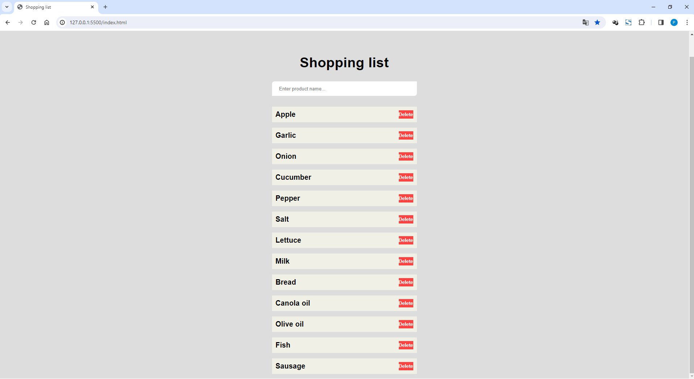

# General Info #
Shopping-list is a simple Front-End project aimed at writing or deleting products.

## Functionality ##

The project enables:
1) Adding products to the list.
2) Deleting products from the list.

## Testing environnement ##

The script as tested for windows 10 Home ( 22H2 64bits).

## Technologies ##

Technologies used: JavaScript, HTML, CSS.

## Getting Started ##

1. Install "Node.js" from https://nodejs.org/en
2. Install "Visual Studio Code" from https://code.visualstudio.com
3. In Visual Studio Code install "HTML5 extension pack".
4. In Visual Studio Code install "JavaScript (ES6) code snippets".
5. In Visual Studio Code install "Live Server".
6. In Visual Studio Code install "vscode-icons".
7. In Visual Studio Code install "Doki Theme".

## Using the app ##

1. Clone the repository to any folder by using.
	```
	git clone https://github.com/PeterTomczyk/Shopping-list.git
	```
2. Open the project from Visual Studio Code.
3. Hover on the "index.html" file, click right and choose "Open with Live Server".
4. And now you can use the app.


